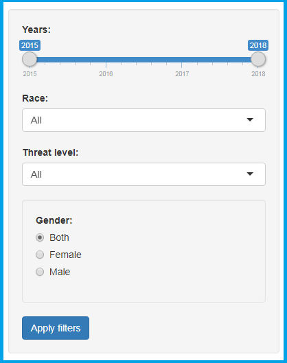

<h3>About</h3>

<h4>Data overview</h4>
This app based on the Washington Post's dataset. In 2015, The Post created a database cataloging every fatal shooting nationwide by a police officer in the line of duty, collecting data on those who were killed and details of the shootings. The effort began because data compiled by the federal government was unreliable and incomplete.

This database is based on news reports, public records, social media and other sources. 

Original dataset is located [here](https://github.com/washingtonpost/data-police-shootings).

<h4>How to use this app?</h4>
This is a Shiny app providing Interactive visualizations and it has two main parts:

1. Filters panel

2. Outputs panel

You just choose any filter on your own and press `Apply` button. Then filtered data will be shown on the right side, on the one of these tabs:

* Map tab - show filtered data on the map
* Plot tab - show some plots based on your filtered data
* Table tab - show filtered data itself 

<h5>Source :</h5>
[https://github.com/armandyne/Developing-Data-Products](https://github.com/armandyne/Developing-Data-Products/tree/master/Course%20Project/shinyapp).
