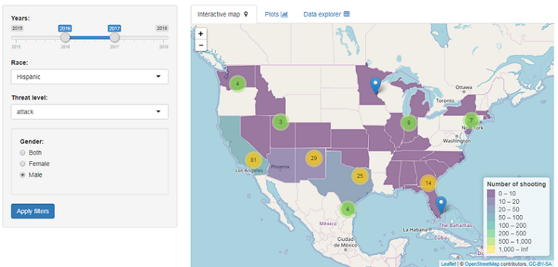
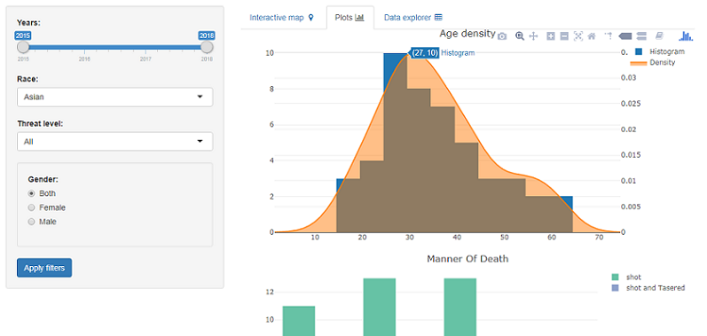

##Introduction
This application provides interactive visualizations based on Washington Post's Database of every fatal shooting by a police in the U.S. since 2015. 

To create beautiful interactive maps and plots this application used the power of `leaflet` and `plotly` packages.

The Shiny application was deployed to the `ShinyApps.io` service and it is available at this link:

* [https://armandyne.shinyapps.io/wp-policeshootings/](https://armandyne.shinyapps.io/wp-policeshootings/)

All source files of the application can be found at the `Github` repository below:

* [https://github.com/armandyne/Developing-Data-Products](https://github.com/armandyne/Developing-Data-Products)

##About dataset
In 2015, The Washington Post created a database cataloging every fatal shooting nationwide by a police officer in the line of duty, collecting data on those who were killed and details of the shootings. 

The effort began because data compiled by the federal government was unreliable and incomplete. 

This database is based on news reports, public records, social media and other sources. 

Original dataset is `csv` file and it is located [here](https://github.com/washingtonpost/data-police-shootings).


##About dataset, pt.2
The original dataset looks like this:
```{r, eval = TRUE, echo=FALSE, message=FALSE, warning=FALSE, results="asis"}
library(knitr)
library(kableExtra)
library(magrittr)
options(knitr.table.format = "html") 
read.csv("./data/fatal-police-shootings-data.csv")[1:5,] %>% 
     kable("html") %>%
     kable_styling(bootstrap_options = c("striped", "bordered"), 
                   position = "left", 
                   font_size = 10, full_width = FALSE) %>%
     row_spec(0, font_size = 10, hline_after = TRUE) %>%
     column_spec(1:13, 
                 border_left = TRUE,
                 border_right = TRUE) %>%
     row_spec(0:5, background = "skyblue")
     
```


What we did apply on the dataset:

* Some transformations
* Adding geographic coordinates
* Dealing with missing values

##Application overview

* Useful interactive map based on your filters
* Useful interactive histograms based on your filters

##Application overview, pt. 2


##Application overview, pt. 3


##
Thank you!